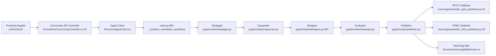
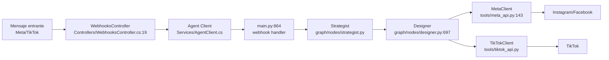
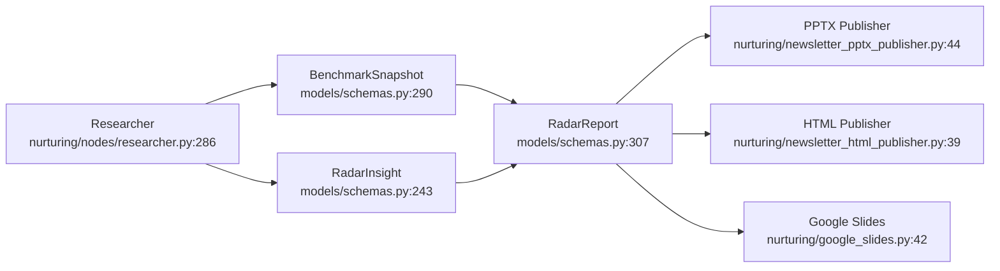
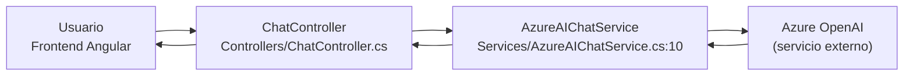
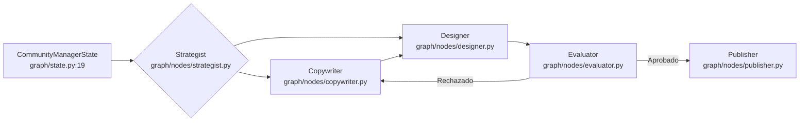

# Mapa de Flujo de Datos — Novit AI Agent

> **Generado desde:** Graphify (grafo de 4.765 nodos, 7.942 aristas, 309 comunidades)
> **Fecha:** 2026-06-16
> **Actualización:** `graphify update .` para refrescar desde el código actual

---

Este documento describe cómo viajan los datos a través del sistema Novit. Está pensado para **desarrolladores nuevos** que necesitan entender el panorama general sin leer todos los archivos fuente.

Cada sección incluye un diagrama de flujo y referencias a los archivos clave donde ocurre cada paso.

---

## 1. Pipeline de Newsletter

El flujo más importante del sistema. Un newsletter se genera, revisa y publica mensualmente.



### Paso a paso

1. **Disparo**: Un usuario desde el frontend Angular (`src/frontend/`) o un scheduler interno (`scheduler/cron.py:26`, clase `AgentScheduler`) inicia el flujo llamando al `CommunityController` (`Controllers/CommunityController.cs:15`) o al `NurturingController` (`Controllers/NurturingController.cs:18`).

2. **Orquestación**: El backend .NET se comunica con el agente Python a través de `AgentClient` (`Services/AgentClient.cs`). El agente recibe la solicitud en `main.py:864` (`_continue_newsletter_workflow()`), que determina qué tipo de contenido generar.

3. **Estrategia**: El nodo **Strategist** (`graph/nodes/strategist.py`) analiza el tipo de contenido y decide el plan editorial: qué temas cubrir, qué formato usar (texto, imagen, video) y qué plataformas targetear.

4. **Redacción**: El nodo **Copywriter** (`graph/nodes/copywriter.py`) genera el contenido textual del newsletter usando un LLM (Azure OpenAI vía `tools/llm.py:132`).

5. **Diseño**: El nodo **Designer** (`graph/nodes/designer.py:697`) toma el texto y produce imágenes, slides PPTX o videos según el plan del strategist. Usa:
   - `tools/image_gen.py:37` — generación de imágenes
   - `tools/video_gen.py:282` — generación de videos con Sora
   - `nurturing/newsletter_pptx_template.py:354` — plantillas de slides

6. **Evaluación**: El nodo **Evaluator** (`graph/nodes/evaluator.py`) revisa la calidad del contenido generado. Si no pasa, se reenvía a Copywriter o Designer según corresponda (hasta 3 reintentos).

7. **Revisión humana (HITL)**: Si está configurado, el flujo se pausa en `NewsletterHitlApprovalRequest` (`main.py:732`) y `CommunityReviewController` (`Controllers/CommunityReviewController.cs:11`) para que un humano apruebe el borrador antes de publicar.

8. **Publicación**: El nodo **Publisher** (`graph/nodes/publisher.py`) distribuye el contenido a través de:
   - `nurturing/newsletter_pptx_publisher.py:44` — genera el archivo PPTX con slides
   - `nurturing/newsletter_html_publisher.py:39` — genera la versión HTML
   - `Services/NurturingMailService.cs` — envía el email a los suscriptores

### Archivos clave del pipeline

| Paso | Archivo | Línea |
|------|---------|-------|
| Trigger frontend | `src/frontend/src/app/app.component.ts` | — |
| Trigger backend | `Controllers/CommunityController.cs` | 15 |
| Trigger scheduler | `scheduler/cron.py` (AgentScheduler) | 26 |
| Cliente agente | `Services/AgentClient.cs` | — |
| Workflow principal | `main.py` (_continue_newsletter_workflow) | 864 |
| Strategist | `graph/nodes/strategist.py` | — |
| Copywriter | `graph/nodes/copywriter.py` | — |
| Designer | `graph/nodes/designer.py` (designer_node) | 697 |
| Evaluator | `graph/nodes/evaluator.py` | — |
| Publisher | `graph/nodes/publisher.py` | — |
| PPTX publisher | `nurturing/newsletter_pptx_publisher.py` | 44 |
| HTML publisher | `nurturing/newsletter_html_publisher.py` | 39 |
| Plantilla PPTX | `nurturing/newsletter_pptx_template.py` (NewsletterTemplateBuilder) | 354 |
| Mail service | `Services/NurturingMailService.cs` | — |
| Aprobación humana | `main.py` (NewsletterHitlApprovalRequest) | 732 |
| Review controller | `Controllers/CommunityReviewController.cs` | 11 |
| Estados del workflow | `graph/state.py` (CommunityManagerState) | 19 |
| Schemas/datos | `models/schemas.py` | — |
| Configuración | `config/settings.py` (get_settings) | 420 |

---

## 2. Pipeline de Redes Sociales

Maneja mensajes entrantes de Instagram/Meta y genera respuestas o contenido nuevo.



### Paso a paso

1. **Recepción**: Un mensaje llega desde Instagram, Facebook o TikTok a través de un webhook capturado por `WebhooksController` (`Controllers/WebhooksController.cs:19`).

2. **Enrutamiento**: El backend .NET convierte el webhook en un `WebhookMessageRequest` (`main.py:179`) y lo envía al agente Python.

3. **Decisión**: El agente (vía `CommunityManagerState` en `graph/state.py:19`) decide si el mensaje requiere respuesta automática, debe escalar a un humano, o inicia la creación de contenido nuevo.

4. **Estrategia**: El **Strategist** determina el tono, la plataforma y el tipo de respuesta.

5. **Diseño**: Si la respuesta incluye contenido visual, el **Designer** genera imágenes o videos.

6. **Publicación**: El contenido se envía a la plataforma correspondiente:
   - **Meta** (`tools/meta_api.py:143`, clase `MetaClient`) — publica en Instagram/Facebook
   - **TikTok** (`tools/tiktok_api.py`, clase `TikTokApiClient`) — publica en TikTok

### Archivos clave

| Paso | Archivo | Línea |
|------|---------|-------|
| Webhook receptor | `Controllers/WebhooksController.cs` | 19 |
| Request webhook | `main.py` (WebhookMessageRequest) | 179 |
| Estado del agente | `graph/state.py` (CommunityManagerState) | 19 |
| Cliente Meta | `tools/meta_api.py` (MetaClient) | 143 |
| Cliente TikTok | `tools/tiktok_api.py` | — |
| Mensaje entrante | `models/schemas.py` (IncomingMessage) | 211 |

---

## 3. Pipeline de AI Radar

Genera un reporte mensual de inteligencia artificial con benchmarks, insights y tendencias.



### Paso a paso

1. **Investigación**: El nodo **Researcher** (`nurturing/nodes/researcher.py:286`, función `researcher_node()`) ejecuta búsquedas masivas (~70 consultas paralelas) usando Brave Search y Serper para recolectar noticias de IA.

2. **Benchmarks**: El researcher también consulta datos de benchmarks de modelos (`BenchmarkSnapshot` en `models/schemas.py:290` y `BenchmarkEntry` en `models/schemas.py:270`).

3. **Insights**: Los resultados se estructuran en objetos `RadarInsight` (`models/schemas.py:243`) que representan una tendencia, novedad o descubrimiento individual.

4. **Reporte**: Todo confluye en `RadarReport` (`models/schemas.py:307`), el nodo central que conecta 16+ comunidades del grafo.

5. **Publicación**: El reporte se publica en múltiples formatos:
   - **PPTX** (`nurturing/newsletter_pptx_publisher.py:44`)
   - **HTML** (`nurturing/newsletter_html_publisher.py:39`)
   - **Google Slides** (`nurturing/google_slides.py:42`, clase `GoogleSlidesRadarPublisher`)

### Archivos clave

| Paso | Archivo | Línea |
|------|---------|-------|
| Researcher | `nurturing/nodes/researcher.py` (researcher_node) | 286 |
| Búsqueda estructurada | `nurturing/tools.py` (brave_search_structured) | — |
| LLM para extracción | `tools/llm.py` (get_newsletter_llm) | 132 |
| Benchmark snapshot | `models/schemas.py` (BenchmarkSnapshot) | 290 |
| Benchmark entry | `models/schemas.py` (BenchmarkEntry) | 270 |
| Radar insight | `models/schemas.py` (RadarInsight) | 243 |
| Radar report | `models/schemas.py` (RadarReport) | 307 |
| Google Slides | `nurturing/google_slides.py` (GoogleSlidesRadarPublisher) | 42 |

---

## 4. Pipeline de Chat

Maneja conversaciones en vivo con usuarios a través del frontend Angular.



### Paso a paso

1. **Interfaz**: El usuario escribe un mensaje en el frontend Angular (`src/frontend/src/app/app.component.ts`).

2. **API**: El `ChatController` (`Controllers/ChatController.cs`) recibe el mensaje y lo envía al servicio de IA.

3. **LLM**: `AzureAIChatService` (`Services/AzureAIChatService.cs:10`) se conecta a Azure OpenAI para generar la respuesta. Soporta streaming (`StreamCompletionAsync` en línea 84) y respuestas completas (`GetCompletionAsync` en línea 42).

4. **Historial**: Las conversaciones se persisten en `PostgresConversationStore` (`Services/PostgresConversationStore.cs`) o `InMemoryConversationStore` (`Services/InMemoryConversationStore.cs`).

### Archivos clave

| Paso | Archivo | Línea |
|------|---------|-------|
| Frontend chat | `src/frontend/src/app/app.component.ts` | — |
| Chat controller | `Controllers/ChatController.cs` | — |
| Servicio Azure AI | `Services/AzureAIChatService.cs` | 10 |
| Streaming | `Services/AzureAIChatService.cs` (StreamCompletionAsync) | 84 |
| Conversación (Postgres) | `Services/PostgresConversationStore.cs` | — |
| Conversación (memory) | `Services/InMemoryConversationStore.cs` | — |
| Herramientas del chat | `Services/ChatToolDefinitions.cs` | — |

---

## 5. Workflow del Agente (LangGraph)

El corazón del agente Python: una máquina de estados que orquesta todos los pipelines anteriores.



### Cómo funciona

El `CommunityManagerState` (`graph/state.py:19`) es el núcleo del agente. Este objeto mantiene el estado completo de la conversación o tarea actual, incluyendo:

- **Input**: mensaje entrante, tipo de contenido, plataforma target
- **Contexto**: preferencias editoriales, historial de interacciones, configuraciones del cliente
- **Output**: contenido generado, resultados de evaluación, estado de publicación

El flujo base es: **Strategist → Copywriter → Designer → Evaluator → Publisher**

Si el Evaluator rechaza el contenido, el flujo vuelve a Copywriter o Designer según qué necesite corrección (hasta 3 reintentos).

### Archivos clave

| Paso | Archivo | Línea |
|------|---------|-------|
| Estado del agente | `graph/state.py` (CommunityManagerState) | 19 |
| Workflow graph | `graph/workflow.py` (build_graph) | — |
| Review workflow | `graph/review_workflow.py` | — |
| Nodo strategist | `graph/nodes/strategist.py` | — |
| Nodo copywriter | `graph/nodes/copywriter.py` | — |
| Nodo designer | `graph/nodes/designer.py` | 697 |
| Nodo evaluator | `graph/nodes/evaluator.py` | — |
| Nodo publisher | `graph/nodes/publisher.py` | — |
| Workflow v2 (newsletter) | `nurturing/workflow_v2.py` (NewsletterState) | 45 |

---

## Nodos Críticos (God Nodes)

Estos nodos aparecen en el grafo conectando muchas comunidades. Son puntos de enrutamiento clave.

### RadarReport (`models/schemas.py:307`)

- **Comunidades que conecta**: 16+ incluyendo Benchmark Data Models, LLM & AI Services, Community Draft Models, Writer Content Pipeline, PPTX Newsletter Publisher, Azure Blob Media Storage, Slide Layout Builder
- **Rol**: Es el modelo de datos central del AI Radar. Todo insight, benchmark y metrica confluye aquí antes de distribuirse a los distintos formatos de publicación.
- **Tipo**: Nodo de datos (no de proceso). No ejecuta lógica, pero es leído por múltiples publishers.

### get_settings() (`config/settings.py:420`)

- **Comunidades que conecta**: ~20 incluyendo LLM & AI Services, AI Radar Test Suite, Benchmark Data Models, Newsletter Workflow, LangGraph Publication Graph, Research Tools, Azure Blob Media Storage, Designer Module, Video Generation
- **Rol**: Punto único de configuración. Carga settings desde variables de entorno y archivos de configuración. Casi todos los módulos del agente Python dependen de él.
- **Tipo**: Configuración estática (se lee al arrancar). No cambia en caliente.

### DotNetClient (`tools/dotnet_client.py:23`)

- **Comunidades que conecta**: Pipedrive Integration, .NET Client, Community Draft Models, Nurturing Email Service
- **Rol**: Cliente HTTP que conecta el agente Python con el backend .NET. Se usa para operaciones de Pipedrive (notas, deals), consultar ciclos de nurturing, y enviar comandos al backend.
- **Dirección del flujo**: Python → .NET (el agente Python llama al backend)

### MetaClient (`tools/meta_api.py:143`)

- **Comunidades que conecta**: Social Media API, Designer Module, Community Manager State
- **Rol**: Cliente para las APIs de Instagram y Facebook. Lee mensajes entrantes, publica respuestas, y gestiona webhooks.
- **Dirección del flujo**: Bidireccional. Recibe webhooks (Meta → Sistema) y publica contenido (Sistema → Meta).

### CommunityManagerState (`graph/state.py:19`)

- **Comunidades que conecta**: LangGraph Publication Graph, Community Draft Models, Designer Module, LLM & AI Services
- **Rol**: La máquina de estados del agente. Contiene todo el contexto de la ejecución actual: qué nodo está activo, qué datos se han generado, y cuál es el siguiente paso.
- **Tipo**: Estado transitorio. Se crea por cada ejecución del workflow y se destruye al completar.

---

## Preguntas para Completar el Documento

El grafo muestra la estructura estática del código. Estas preguntas ayudan a entender el comportamiento en runtime que el grafo no captura:

1. ¿Cuál es el trigger exacto del newsletter? ¿Arranca por scheduler (cron), por llamada HTTP desde el frontend, o por webhook de Calendly?

2. Cuando el Writer pasa datos al Designer, ¿el Designer espera el texto completo o puede empezar a trabajar mientras el Writer sigue generando?

3. En el pipeline de redes sociales, ¿el agente decide automáticamente si responder o escalar a un humano? ¿Dónde está esa lógica de decisión?

4. El AI Radar: ¿con qué frecuencia se genera? ¿Lo dispara un cron (`scheduler/cron.py`), un comando manual desde el frontend, o un webhook?

5. ¿Hay otros pipelines importantes que no están capturados? Por ejemplo: migraciones de base de datos, sincronización con Pipedrive, webhooks de Meta/TikTok entrantes, despliegues automáticos.

6. `get_settings()` conecta ~20 comunidades: ¿la configuración se lee una vez al arrancar o puede cambiar dinámicamente y reconfigurar pipelines en caliente?

7. Además de la aprobación del newsletter (HITL), ¿hay otros pasos donde intervenga un humano? ¿Moderación de respuestas en redes? ¿Revisión de contenido generado por AI?

8. Si el pipeline falla (ej: Azure Blob Media no responde, el Designer lanza error), ¿el sistema reintenta automáticamente, encola para después, o aborta? ¿Hay un límite de reintentos?

9. ¿Hay diferencias entre el pipeline de producción y pruebas/desarrollo? Por ejemplo: en tests se salta la publicación real a Meta/TikTok, o se usa un LLM diferente.

10. ¿Hay documentación, diagramas o decisiones de diseño (ADRs) adicionales que deberían referenciarse desde este documento?

---

## Para Mantener este Documento Actualizado

```bash
# Si cambia el código, refrescar el grafo:
graphify update .

# Luego regenerar este documento consultando las rutas clave:
graphify query "newsletter pipeline" --budget 1500
graphify path "CommunityManagerState" "NurturingMailService"
graphify explain "RadarReport"
```

> Este documento se generó desde el grafo de Graphify. Las referencias a archivos y líneas son precisas al momento de generación. Si el código cambia, corre `graphify update .` y actualiza las secciones correspondientes.
